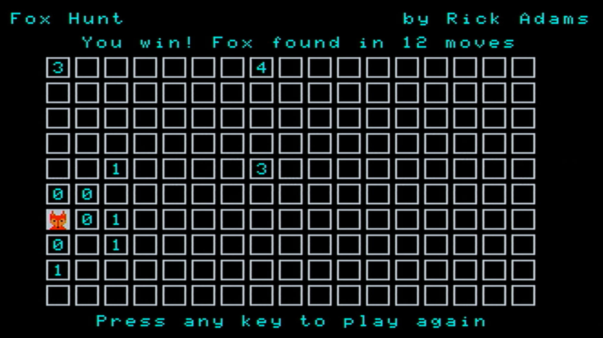

FOX HUNT: An original "Find the Fox" puzzle game in BASIC for the Tandy Color Computer 3
==========

This BASIC game will hide a "Fox" in a random square amongst a collection of many squares.  Use the arrow
keys to move the currently selected square, and hit ENTER to guess whether the fox is in that square.

If the fox is in that square, you win!  If not, you will see a numeric code indicating how close you are
to the fox.  A zero means you are very close, a nine means you are very far away.

Try to find the fox in the fewest number of moves!

`redistribute/foxhunt.bas` is the BASIC program to use; the other `foxhunt.bas` file is the source before
being run through my BASIC preprocessor utility, which is in another of my repositories.
